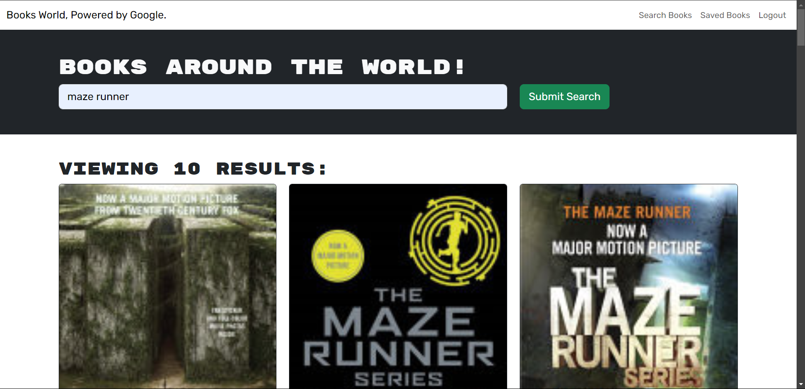
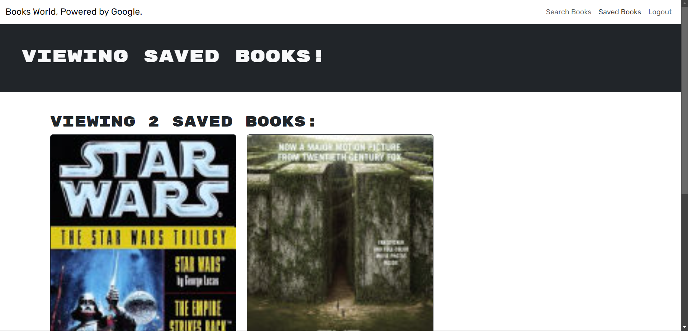

# Book-Search-Engine-MERN
Book Search Engine using MERN Stack 

## Description
This is MERN Stack Book Search Engine which let you search any book around the world, uses Google Books Api. 

## Live App Link
[Live Link]()

## User Story
AS AN avid reader
 
I WANT to search for new books to read
 
SO THAT I can keep a list of books to purchase

## Installation

 Install the following:
  
 npm install

 ## Preview
 

 

 ## License

 

 This project is licensed under the [MIT License](https://choosealicense.com/licenses/mit/) license.

 ## Contributing

 Pull requests are most welcome

 ## Queries

 GitHub: 
